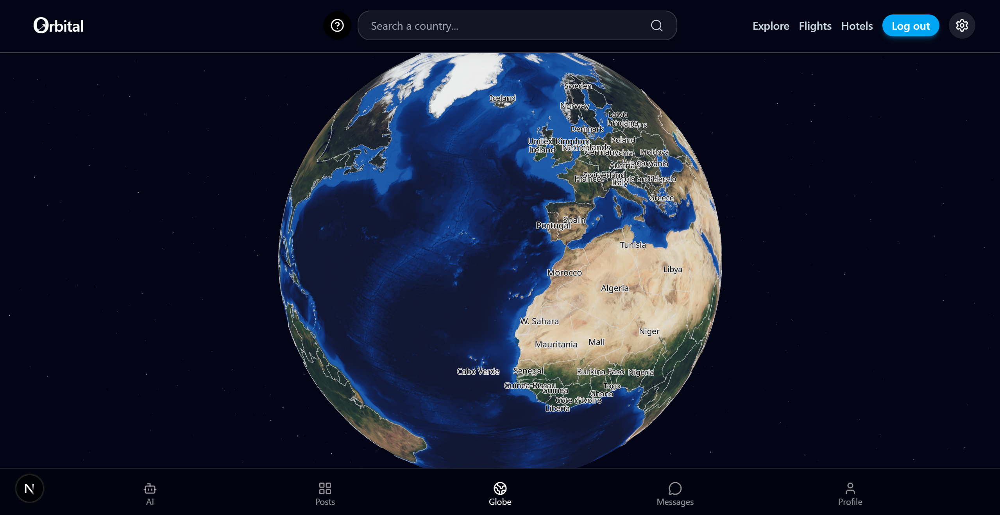
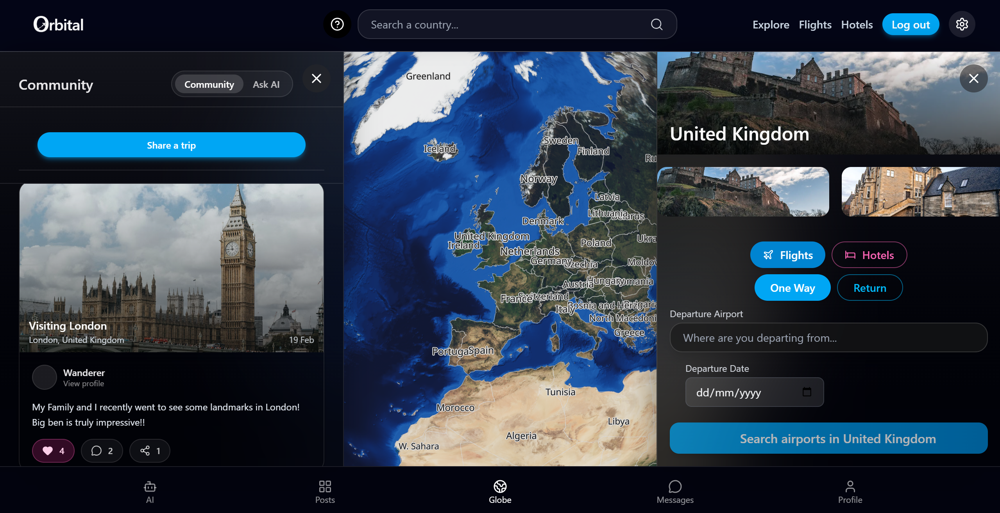
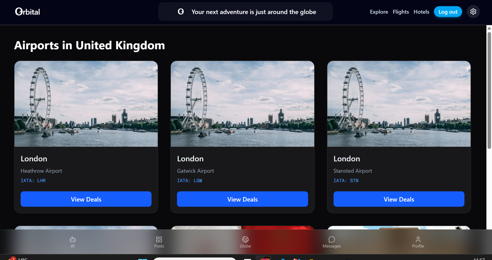
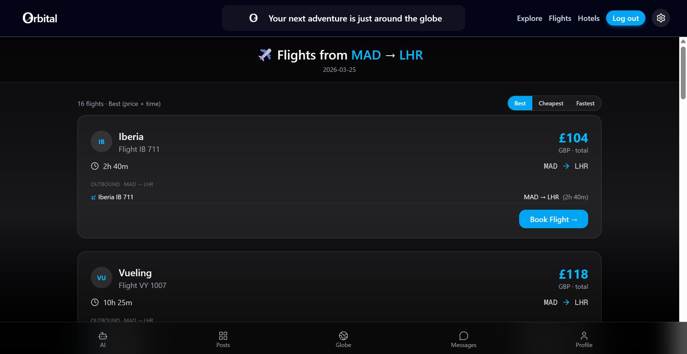
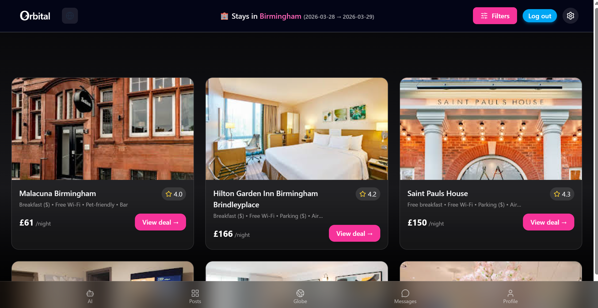
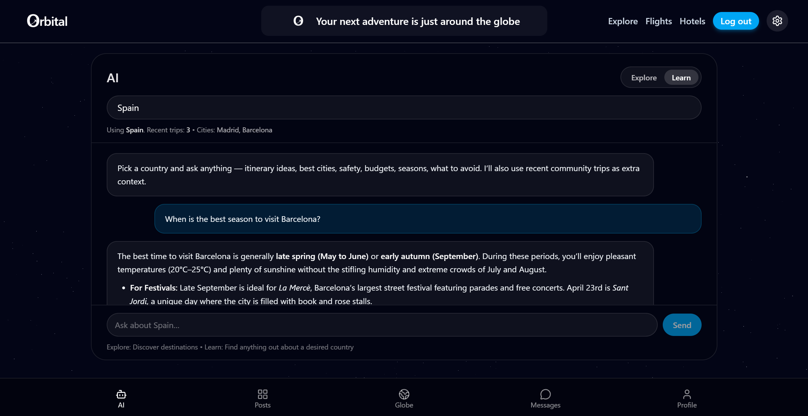
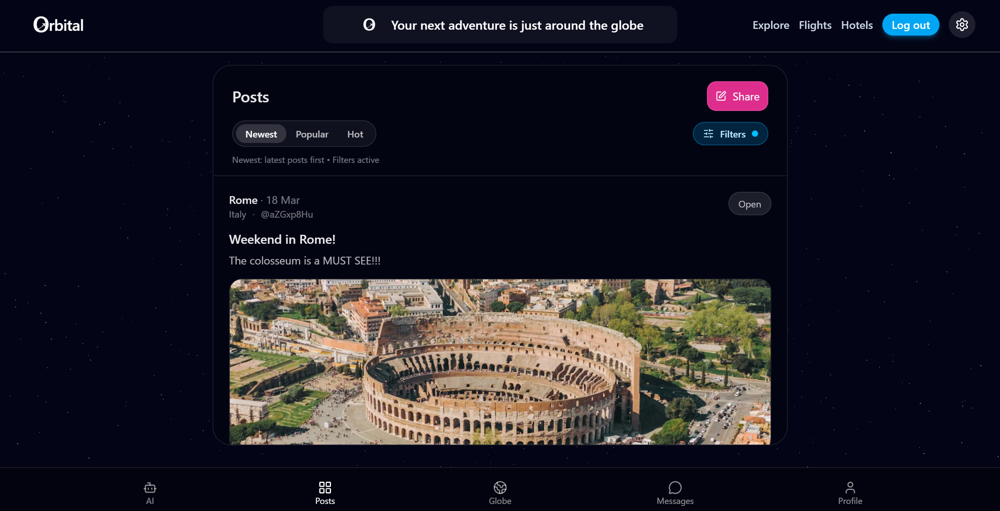
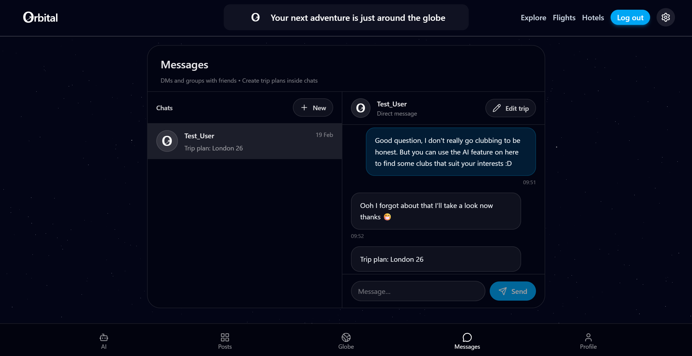
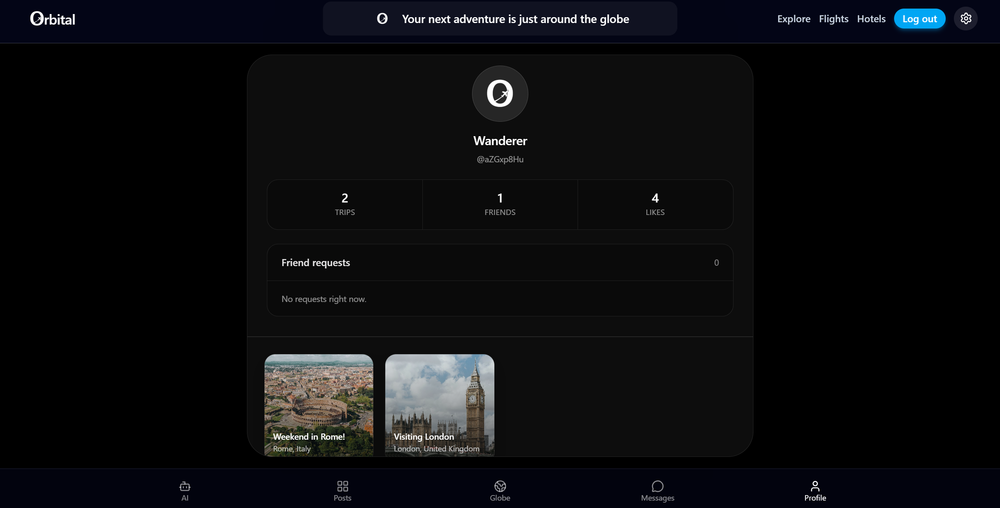

# Orbital

Orbital is an interactive travel exploration web app built around a 3D globe. Users can rotate the globe, select countries, explore destination information, compare flights and hotels, and use social / AI-assisted discovery features.

## Live Demo
https://orbital-explore.vercel.app

## Features
- Interactive 3D globe
- Country search and focus transitions
- Country information panel
- Flights and hotels exploration
- Social / AI explore panel
- Guided tutorial overlay
- Responsive mobile and desktop experience

## Tech Stack
- Next.js
- React
- TypeScript
- Tailwind CSS
- React Three Fiber / Drei
- Firebase
- External travel / image APIs

## Getting Started
```bash
npm install
npm run dev
```
## Environment Variables
### Create a .env.local file and add your own keys for:
    NEXT_PUBLIC_FIREBASE_API_KEY=
    NEXT_PUBLIC_FIREBASE_AUTH_DOMAIN=
    NEXT_PUBLIC_FIREBASE_PROJECT_ID=
    NEXT_PUBLIC_FIREBASE_STORAGE_BUCKET=
    NEXT_PUBLIC_FIREBASE_MESSAGING_SENDER_ID=
    NEXT_PUBLIC_FIREBASE_APP_ID=
    NEXT_PUBLIC_PEXELS_KEY=
    SERPAPI_KEY=
    AVIATIONSTACK_KEY=
    GEMINI_API_KEY=

## Screenshots

The Orbital Globe


Selecting a country


Selecting an Airport


Viewing Flights


Viewing Hotels


Chatting to AI


Viewing Posts


Chatting to friends


Viewing Profile


## Dissertation Context
This project was developed focusing on making travel discovery more interactive, exploratory, and visually engaging through a globe-based interface.